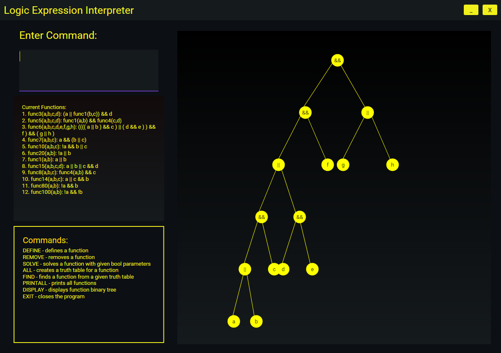
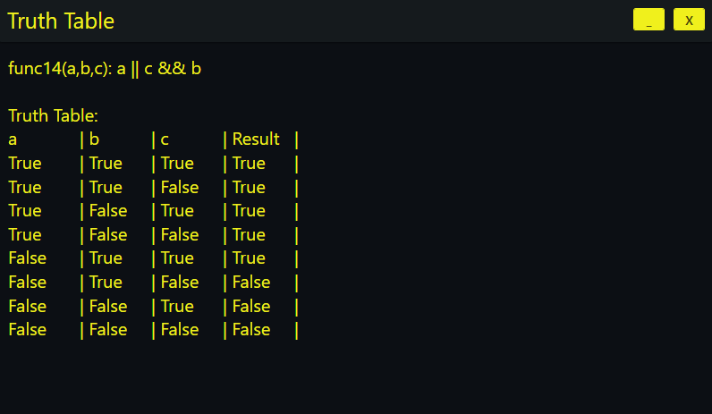

<h1 align="center">Logical Expression Interpreter</h1>

    An application that can create logical functions and solve them, create truth tables, find expressions from truth tables and visualize expression trees.

  

## 🖥️ The Project
My coursework for Data Structures and Algorithms in university. 
The program is written in C# on the framework WPF.

# Features: 
Note: All input must be in the given format.
## ⚡ Adding and removing logical functions // DEFINE & REMOVE Commands
The DEFINE command creates and stores a logical function with the input expression for future evaluation. 
**Example: DEFINE func1(a,b): a && !b**

The REMOVE cammand removes the function with the input name. 
**Example: REMOVE func1**

## ⚡ Solving of boolean expressions // SOLVE Command
The SOLVE command allows the user to solve the defined functions with boolean values 
**Example: SOLVE func1(true,false)**  

## ⚡ Creating a Truth Table for a logic function // ALL Command
The ALL command creates a Truth Table for a chosen logic function's expression  
**Example: ALL func14** 

  

## ⚡ Finding an expression from a given Truth Table // FIND Command
The FIND command takes a given truth table and uses an **Evolutionary algorithm** to find an expression that fits the table/gives the same result. 
It also checks the already defined user functions for any matches.  
**Example: FIND (+ a path to a file with a truth table)**

## ⚡ Expression Tree Visualization // DISPLAY Command
The DISPLAY command displays the binary expression tree of an expression to the screen.  
**Example: DISPLAY Func6**

### Other Commands:
PRINTALL - prints all defined functions  
EXIT - another way to close the program
